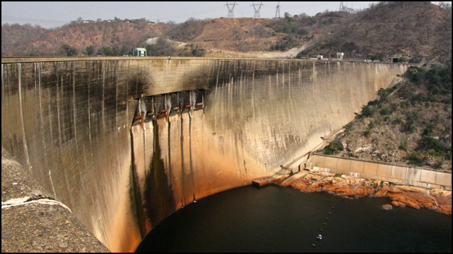

```{r}
#| include: false
knitr::opts_chunk$set(
  fig.width  = 8,
  message    = FALSE,
  warning    = FALSE,
  comment    = "",
  cache      = FALSE,
  fig.retina = 3
)
```

```{r}
#| echo: false
#| fig-align: center
#| out.width: '100%'


```

# Background

In this lab we will explore the impacts of tessellated surfaces and the modifiable areal unit problem (MAUP) using the National Dam Inventory maintained by the United States Army Corps of Engineers. The work requires writing reusable functions and careful consideration of feature aggregation/simplification, spatial joins, and data visualization. The end goal is to visualize the distribution of dams and their purposes across the country.

**DISCLAIMER**: This lab can be computationally intensive. For some steps you may be processing hundreds of millions of relations; run code chunk-by-chunk during development rather than knitting the whole document repeatedly. Your final knit may take a few minutes. Be proud — the report will summarize analyses over very large geometric relations.

****

This lab covers 4 main skills: 

1. **Tessellating surfaces** to discretize space
2. **Geometry simplification** to expedite expensive intersections
3. **Writing functions** to automate repetitive reporting and mapping tasks
4. **Point-in-polygon counts** to aggregate point data

## Graduate-Level Expectations

In addition to producing correct code and outputs, your submission should:

- **Justify methodological choices**: Why did you choose a particular tessellation `keep` percentage for simplification? How did you balance computational efficiency with map detail?
- **Document performance impacts**: Measure and report computation time and geometric accuracy changes resulting from simplification. How do results differ?
- **Apply spatial reasoning**: Use spatial predicates (e.g., `st_touches`, `st_contains`) to identify and describe geometric relationships in the dam dataset that raw counts cannot reveal.
- **Compare across methods**: When multiple tessellation approaches yield different clustering patterns, explain which pattern better supports real-world dam management decisions and why.
- **Connect to lecture**: Explicitly cite the MAUP problem, simplification algorithms (Douglas-Peucker vs. Visvalingam), and spatial predicate definitions from week 3 lectures in your analysis.

### Libraries

```{r}
#| echo: false
#| eval: true
#| message: false
#| warning: false

# Data Science
library(tidyverse) # data wrangling
library(sf)        # Working with vector data
library(rmapshaper)# Simplify geometries
library(units)     # manage your units

# Data
remotes::install_github("mikejohnson51/AOI") # get US counties
library(AOI) # county boundaries

# Visualization
library(gghighlight) # ggplot conditional highlighting
library(knitr) # table generation
library(kableExtra) # making tables pretty
```


******

# Question 1: 

Here we will prepare five tessellated surfaces from CONUS and write a function to plot them in a descriptive way.

### Step 1.1

First, we need a spatial file of CONUS counties. For future area calculations we want these in an equal area projection (`EPSG:5070`). 

To achieve this:

  - get an `sf` object of US counties (`AOI::aoi_get(state = "conus", county = "all")`)

  - transform the data to `EPSG:5070`

```{r}
conus <- aoi_get(state = "conus", county = "all")

conus <- st_transform(conus, 5070)
```


### Step 1.2

For triangle based tessellations we need point locations to serve as our "anchors".  

To achieve this:

  - generate county centroids using `st_centroid`
  
  - Since, we can only tessellate over a feature we need to _combine_ or _union_ the resulting 3,108 `POINT` features into a single `MULTIPOINT` feature
  
  - Since these are point objects, the difference between union/combine is mute

```{r}
#| output: false
county_centroids <- st_centroid(conus)

county_pts <- st_union(county_centroids)

class(county_pts)

length(county_pts)
```


### Step 1.3

Tessellations/Coverage's describe the **extent** of a region with geometric shapes, called **tiles**, with _no_ overlaps or gaps.

**Tiles** can range in _size_, _shape_, _area_ and have different methods for being created.

Some methods generate triangular tiles across a set of defined points (e.g. `Voronoi` and Delaunay triangulation)

Others generate equal area tiles over a known extent (`st_make_grid`)

For this lab, we will create surfaces of CONUS using using 4 methods, 2 based on an extent and 2 based on point anchors:

**Tessellations** :

  - `st_voronoi`: creates a Voronoi tessellation

  - `st_triangulate`: triangulates a set of points (not constrained)
  
**Coverages**:

  - `st_make_grid`: creates a square grid covering the geometry of an sf or sfc object

  - `st_make_grid(square = FALSE)`: creates a hexagonal grid covering the geometry of an sf or sfc object

  - The side of coverage tiles can be defined by a cell resolution or a specified number of cell in the X and Y direction

****      

For this step: 

   - Make a voroni tessellation over your county centroids (`MULTIPOINT`)
   - Make a triangulated tessellation over your county centroids (`MULTIPOINT`)
   - Make a gridded coverage with n  = 70, over your counties object
   - Make a hexagonal coverage with n  = 70, over your counties object

In addition to creating these 4 coverage's we need to add an ID to each _tile_. 

To do this:

  - add a new column to each tessellation that spans from `1:n()`. 
  
  - Remember that **ALL** tessellation methods return an `sfc` `GEOMETRYCOLLECTION`, and to add attribute information - like our ID -  you will have to coerce the `sfc` list into an `sf` object (`st_sf` or `st_as_sf`)

Last, we want to ensure that our surfaces are topologically valid/simple.
  
  - To ensure this, we can pass our surfaces through  `st_cast`.

  - Remember that casting an object explicitly (e.g. `st_cast(x, "POINT")`) changes a geometry
  
  - If no output type is specified (e.g. `st_cast(x)`) then the cast attempts to simplify the geometry. 
  
  - If you don't do this you might get unexpected "TopologyException" errors.


```{r}
voronoi <- county_pts |>
  st_voronoi() |>
  st_cast()

triangulated <- county_pts |>
  st_triangulate() |>
  st_cast()

gridded <- conus |>
  st_make_grid(n = 70) |>
  st_as_sf() |>
  mutate(id = 1:n())

hexagonal <- conus |>
  st_make_grid(n = 70, square = FALSE) |>
  st_as_sf() |>
  mutate(id = 1:n())

voronoi <- voronoi |>
  st_as_sf() |>
  mutate(id = 1:n())

triangulated <- triangulated |>
  st_as_sf() |>
  mutate(id = 1:n())
```

### Step 1.4

If you plot the above tessellations you'll see that the **Voronoi**, **Delaunay triangulation**, **hexagon**, and **square grids** all produce regions far beyond the boundaries of CONUS.

```{r}
#| output: false
plot(voronoi)

plot(triangulated)

plot(hexagonal)

plot(gridded)
```
We need to crop these boundaries to CONUS borders. 

To do this, we need two different approaches:
- **`st_intersection()`** for Voronoi and Delaunay (these tessellations create geometries that extend infinitely/far beyond the study area; intersection clips them at the exact boundary)
- **`st_filter()`** for hexagon and square grids (these regular grids are already designed to fit; filtering keeps only the tiles that intersect CONUS)

Either way, we'll need a geometry of CONUS to serve as our clipping feature. We can get this by unioning our existing county boundaries.

```{r, eval = TRUE}
conus_boundary <- conus |>
  st_union()
```

### Step 1.5

With a single feature boundary, we must carefully consider the complexity of the geometry. Remember, the more points our geometry contains, the more computations needed for spatial predicates our differencing. For a task like ours, we do not need a finely resolved coastal border. 


To achieve this: 

- Simplify your unioned border using the Visvalingam algorithm provided by `rmapshaper::ms_simplify`. 

- Choose what percentage of vertices to retain using the `keep` argument and work to find the highest number that provides a shape _you_ are comfortable with for the analysis:

```{r}
#| output: false

?ms_simplify

conus_boundary_simple <- ms_simplify(conus_boundary, keep = 0.07)

plot(conus_boundary_simple)

plot(conus_boundary)
```

> I chose to use keep = 0.07. ?ms_simplify revealed that the default was 0.05, so I started there and noticed several coastal islands disappeared from the boundary. I worked my way up from there until all coastal islands reappeared at 0.07. While we may not need a finely resolved coastal border, I did want to ensure the major islands off the coast were included, as dams do exist on some of these islands. 


- Once you are happy with your simplification, use the `mapview::npts` function to report the number of points in your original object, and the number of points in your simplified object. 

- How many points were you able to remove? What are the consequences of doing this computationally?

```{r}
#| output: false

mapview::npts(conus_boundary)

mapview::npts(conus_boundary_simple)
```

> The original CONUS boundary contained 11,292 points, and the simplified version contains 807 points. This reduction should significantly decrease subsequent spatial computational time throughout the lab.


- Finally, crop **all four grids** to the CONUS boundary—but using different methods:
  - **Voronoi & Delaunay** (geometry-based tessellations): Use `st_intersection()` to *cut* these geometries at the CONUS boundary. These tessellations create boundaries that extend well beyond CONUS; intersection actually trims them.
  - **Hexagon & Square grids** (regular grids): Use `st_filter()` to keep only tiles that touch CONUS. These grids are already regularly aligned; filtering just discards edge tiles without modifying them.

```{r}
voronoi_crop <- st_intersection(st_geometry(voronoi), conus_boundary_simple) |>
  st_as_sf() |>
  mutate(id = 1:n())


triangulated_crop <- st_intersection(st_geometry(triangulated), conus_boundary_simple) |>
  st_as_sf() |>
  mutate(id = 1:n())


gridded_crop <- st_filter(gridded, conus_boundary_simple)


hexagonal_crop <- st_filter(hexagonal, conus_boundary_simple)
```


### Step 1.6

The last step is to plot your tessellations. We don't want to write out 5 ggplots (or mindlessly copy and paste)

Instead, lets make a function that takes an `sf` object as _arg1_ and a character string as _arg2_ and returns a ggplot object showing _arg1_ titled with _arg2_. 

****

The form of a function is: 

```{r}
#| echo: true
#| eval: false

name = function(arg1, arg2) {
  
  ... code goes here ...
  
}
```

*****

For this function: 

  - The name can be anything you choose, _arg1_ should take an `sf` object, and _arg2_ should take a character string that will title the plot
  
  - In your function, the code should follow our standard `ggplot` practice where your data is _arg1_, and your title is _arg2_
  
  - The function should also enforce the following:
  
    - a `white` fill
    
    - a `navy` border
    
    - a `size` of 0.2
    
    - `theme_void``
    
    - a caption that reports the number of features in _arg1_
    
      - You will need to paste character stings and variables together.

```{r}
plot_tessellation_function = function(sf_object, title) {
  ggplot(sf_object) + 
    geom_sf(fill = "white", color = "navy", linewidth = 0.2) +
    theme_void() +
    labs(title = title, caption = paste(nrow(sf_object), "features")) +
    theme(plot.caption = element_text(size = 11, hjust = 0.5))}
```

### Step 1.7

Use your new function to plot each of your tessellated surfaces and the original county data (5 plots in total):

```{r}
plot_tessellation_function(voronoi_crop, "Voronoi")

plot_tessellation_function(triangulated_crop, "Triangulated")

plot_tessellation_function(hexagonal_crop, "Hexagonal")

plot_tessellation_function(gridded_crop, "Square")

plot_tessellation_function(conus, "U.S. Counties")
```

# Question 2:

In this question, we will write out a function to summarize our tessellated surfaces.

### Step 2.1

First, we need a function that takes a `sf` object and a `character` string and returns a `data.frame`. 

For this function: 

  - The function name can be anything you choose, _arg1_ should take an `sf` object, and _arg2_ should take a character string describing the object
  
  - In your function, calculate the area of `arg1`; convert the units to km^2^; and then drop the units
  
  - Next, create a `data.frame` containing the following:
  
      1. text from _arg2_
      
      2. the number of features in _arg1_
      
      3. the mean area of the features in _arg1_ (km^2^)
      
      4. the standard deviation of the features in _arg1_
      
      5. the total area (km^2^) of _arg1_
      
  - Return this `data.frame`
  
```{r}
area_df_function <- function(sf_object, label){
  area_km2 <- sf_object |>
    st_area() |>
    set_units("km^2") |>
    drop_units()
  
  data.frame(tesselation = label, n_features = nrow(sf_object), mean_area_km2 = mean(area_km2), sd_area_km2 = sd(area_km2), total_area_km2 = sum(area_km2))}
```

### Step 2.2 

Use your new function to summarize each of your tessellations and the original counties. 

```{r}
#| output: false

area_df_function(voronoi_crop, "Voronoi")

area_df_function(triangulated_crop, "Triangulated")

area_df_function(hexagonal_crop, "Hexagonal")

area_df_function(gridded_crop, "Square")

area_df_function(conus, "Counties")
```


### Step 2.3

Multiple `data.frame` objects can bound row-wise with `bind_rows` into a single `data.frame`

For example, if your function is called `sum_tess`, the following would bind your summaries of the triangulation and voroni object.

```{r}
all_surfaces <- bind_rows(area_df_function(triangulated_crop, "triangulated"),
  area_df_function(voronoi_crop, "voronoi"), 
  area_df_function(hexagonal_crop, "hexagonal"), 
  area_df_function(gridded_crop, "square"), 
  area_df_function(conus, "counties"))
```

### Step 2.4

Once your 5 summaries are bound (2 tessellations, 2 coverage's, and the raw counties) print the `data.frame` as a nice table using `knitr`/`kableExtra`/`flextable` or your preferred table formatting package.

```{r}
library(flextable)

ft_one <- flextable(all_surfaces) |>
  set_header_labels(tesselation = "Tessellation",
    n_features = "Features",
    mean_area_km2 = "Mean Area (km²)",
    sd_area_km2 = "SD Area (km²)",
    total_area_km2 = "Total Area (km²)") |> 
    colformat_double(digits = 0)

ft_one
```

### Step 2.5

Comment on the traits of each tessellation. Be specific about how these traits might impact the results of a point-in-polygon analysis in the contexts of the modifiable areal unit problem and with respect computational requirements.

> The counties tessellation standard deviation is large, meaning some counties are significantly bigger than others. For point in polygon comparisons, this could mean that counties with many points could just be large in area rather than dense. This is an example of the Modifiable Areal Unit Problem, as comparing point concentration across regions could become misleading. 

>The voronoi tessellation is similar to counties, with the same number of features and mean area, but a slightly smaller standard deviation in area. This means tiles are more equal in size than in the counties tessellation and therefore more comparable. However, the voronoi tessellation is still constructed using county centroid locations, so geographic distribution is still uneven. 

>For both the hexagonal and square tessellations, the standard deviation is 0. This makes sense as the tessellations are all the same size, but it means they’re not taking into account any geographical geometries and are completely arbitrary. For point in polygon comparisons this means counts are comparable across tiles, however the boundaries have little meaning for management decisions.

>The triangulated tessellation has almost twice the amount of features than any other tessellation, which would require significantly more computational bandwidth for analysis. More features means more tiles with no point counts, which could alter analysis. 

>These differences illustrate how the choice of tessellation shapes analytical conclusions, even when the underlying data remains the same.


****

# Question 3: Dam Distribution Analysis & Tessellation Selection

The data we will analyze in this lab are from the U.S. Army Corps of Engineers National Dam Inventory (NID). This dataset documents ~91,000 dams in the United States and includes attributes such as design specifications, risk level, age, and purpose.

Dam management agencies face a critical question: **Where are dams actually clustered, and how do I visualize that clustering in a way that supports infrastructure planning decisions?** The answer depends on your choice of geographic boundaries—that is, your tessellation. Different tessellations will reveal different patterns of dam concentration. Your job in this question is to:

1. Quantify dam distributions across multiple tessellation methods
2. Understand how the **modifiable areal unit problem (MAUP)** creates different narratives from the same underlying data
3. **Select and justify the tessellation that best supports management decisions** about dam clustering

For the remainder of this lab we will analyze the distributions of these dams using point-in-polygon analysis.

### Step 3.1

In the tradition of this class - and true to data science/GIS work - you need to find, download, and manage raw data. THe NID dataset is available as a CSV download from the USACE website [here](https://nid.sec.usace.army.mil/nid/#/downloads). Grab the CSV.

- Return to your RStudio Project and read the data in using the `readr::read_csv`
  - Use `janitor::clean_names()` to standardize column names to snake_case (tidy data convention)
  - After reading the data in, be sure to remove rows that don't have location values (`!is.na()`)
  - Convert the `data.frame` to a `sf` object by defining the coordinates and CRS
  - Transform the data to a CONUS AEA (EPSG:5070) projection - matching your tessellation
  - Filter to include only those within your CONUS boundary

 
```{r}
#| message: false
# Prefer a local NID CSV named `nation.csv`; otherwise download to that filename
nid_url <- "https://nid.sec.usace.army.mil/api/nation/csv"
dir.create("data", showWarnings = FALSE)
nid_dest <- "data/nation.csv"
if (file.exists(nid_dest)) {
  message("Using local NID file: ", nid_dest)
} else {
  tryCatch({
    message("Downloading NID CSV to: ", nid_dest)
    download.file(nid_url, nid_dest, quiet = FALSE, mode = "wb")
  }, error = function(e) {
    message("NID download failed: ", e$message)
  })
}

# read the CSV (will error if download failed and file missing)
if (!file.exists(nid_dest)) stop("NID CSV not found at ", nid_dest)
dams <- readr::read_csv(nid_dest, skip =1, show_col_types = FALSE) |> 
  janitor::clean_names()

usa <- AOI::aoi_get(state = "conus") %>% 
  st_union() %>% 
  st_transform(5070)

dams2 <- dams %>% 
  filter(!is.na(latitude)) %>%
  st_as_sf(coords = c("longitude", "latitude"), crs = 4326) %>% 
  st_transform(5070) %>% 
  st_filter(usa)
```

### Step 3.2

Following the in-class examples develop an efficient point-in-polygon function that takes:

  - points as `arg1`, 
  - polygons as `arg2`,
  - The name of the id column as `arg3`
  
The function should make use of spatial and non-spatial joins, sf coercion and `dplyr::count`. The returned object should be input `sf` object with a column - `n` -  counting the number of points in each tile.
  
```{r}
point_in_polygon_function <- function(points, polygons, id_col){
  points <- st_transform(points, st_crs(polygons))
   polygons |>
    st_join(points) |>
    st_drop_geometry() |>
    count(.data[[id_col]]) |>
    right_join(polygons, by = id_col) |>
    mutate(n = replace_na(n, 0)) |>
    st_as_sf()}
```

### Step 3.3 

Apply your point-in-polygon function to each of your five tessellated surfaces where:

- Your points are the dams
- Your polygons are the respective tessellation
- The id column is the name of the id columns you defined.

```{r}
#| output: false

voronoi_dams <- point_in_polygon_function(dams2, voronoi_crop, "id")

nrow(voronoi_dams) == nrow(voronoi_crop)
sum(is.na("n")) == 0

plot(voronoi_dams["n"])


triangulated_dams <- point_in_polygon_function(dams2, triangulated_crop, "id")

nrow(triangulated_dams) == nrow(triangulated_crop)
sum(is.na("n")) == 0

plot(triangulated_dams["n"])


gridded_dams <- point_in_polygon_function(dams2, gridded_crop, "id")

nrow(gridded_dams) == nrow(gridded_crop)
sum(is.na("n")) == 0

plot(gridded_dams["n"])


hexagonal_dams <- point_in_polygon_function(dams2, hexagonal_crop, "id")

nrow(hexagonal_dams) == nrow(hexagonal_crop)
sum(is.na("n")) == 0

plot(hexagonal_dams["n"])


county_dams <- point_in_polygon_function(dams2, conus, "fip_code")

nrow(county_dams) == nrow(conus)
sum(is.na("n")) == 0

plot(county_dams["n"])
```


### Step 3.4

Lets continue the trend of automating our repetitive tasks through function creation. This time make a new function that extends your previous plotting function.

For this function: 

  - The name can be anything you chose, _arg1_ should take an `sf` object, and _arg2_ should take a character string that will title the plot
  
  - The function should also enforce the following:
  
    - the fill aesthetic is driven by the count column `n`
    
    - the col is `NA`
    
    - the fill is scaled to a continuous `viridis` color ramp
    
    - `theme_void`
    
    - a caption that reports the number of dams in _arg1_ (e.g. `sum(n)`)
    
      - You will need to paste character stings and variables together.
      
```{r}
plot_pip_function <- function(sf_object, title) {
  ggplot(sf_object) +
    geom_sf(aes(fill = n), color = NA) +
    scale_fill_viridis_c() +
    theme_void() +
    labs(title = title,caption = paste(sum(sf_object$n), "dams")) +
    theme(plot.caption = element_text(size = 11, hjust = 0.5))}
```

### Step 3.5

Apply your plotting function to each of the 5 tessellated surfaces with Point-in-Polygon counts:


```{r}
plot_pip_function(voronoi_dams, "Voronoi")

plot_pip_function(triangulated_dams, "Triangulated")

plot_pip_function(hexagonal_dams, "Hexagonal")

plot_pip_function(gridded_dams, "Square")

plot_pip_function(county_dams, "U.S. Counties")
```


### Step 3.6 

**Policy Analysis: Tessellation and Decision-Making**

Now that you have dam counts across all five tessellation methods, compare the results. Specifically:

**a.** Create a side-by-side visualization (faceted or small multiples) showing dam clustering under each of the five tessellations. Use `patchwork` or `cowplot` to arrange the 5 plots you created in Step 3.5 for direct visual comparison.

**b.** Identify **2–3 geographic regions** where tessellation choice produces substantially *different* patterns (e.g., one method shows a clear hotspot while another shows diffuse distribution). For each region, describe the pattern difference and explain *why* the tessellation geometry creates divergent results. Reference the characteristics from your Q2 summary (number of tiles, mean area, standard deviation).

**c.** **Which single tessellation would you recommend to a dam operations manager seeking to understand geographic clustering?** Justify your choice by addressing:
   - Does the tessellation align with natural or management decision-making units (e.g., river basins, states, hydrologic regions)?
   - Does it reveal meaningful patterns without over-fragmenting the landscape or creating artificial boundaries?
   - How does MAUP influence your recommendation—are other tessellations equally valid, just for different questions?
   - How did simplification affect your choice? Would a coarser or finer simplification (different `keep` percentage) change your recommendation?
   - What does "best supports management decisions" mean concretely in your context—does it matter more that hot spots are obvious, or that boundaries align with jurisdictions?

Your answer should be **3–4 paragraphs** and grounded in the actual visualizations and patterns you observe from your tessellation comparisons.

```{r}
library(patchwork)

plot_pip_function(voronoi_dams, "Voronoi") +
plot_pip_function(triangulated_dams, "Triangulation") +
plot_pip_function(hexagonal_dams, "Hexagonal") +
plot_pip_function(gridded_dams, "Square") +
plot_pip_function(county_dams, "Counties") +
plot_layout(ncol = 2)
```

>Based on the plots, the hexagonal and square tessellations seem to lose some of the clustering detail in the west, as well as the hotspot in the northern U.S. that is clear in all of the other tessellations. These grids have the largest mean area and set arbitrary boundaries which dissipates dam concentation. The triangulated tessellation also significantly diffuses the hotspot in the central U.S. Since the triangulated tessellation has the most tiles, its tiles are generally smaller and therefore dam counts get spread across more units. 

>If a dam operations manager wanted to understand geographic clustering I would recommend using the counties tessellation. Counties is the only tessellation that aligns with meaningful boundaries that reflect jurisdictions and decision-making units. As such, it reveals significant patterns and hotspots without over-fragmenting the landscape.  The triangulated, hexagonal, and square tessellations all lose detail compared to counties, and voronoi is based on county geometry while not actually reflecting true county boundaries. While counties does have the highest standard deviation in tile area which may not be ideal for certain analysis, in the context of dam operations having legally meaningful boundaries is more important. 

>The MAUP problem is clearly illustrated by the plots, the same data produced different clustering patterns depending on which tessellation was used. It would be valid to use hexagonal and square grids if doing an analysis on dam density as their tiles are uniform in size with a standard deviation of 0 km squared. Voronoi and triangulated tessellations could work well if meaningful points were used to derive the tessellations rather than the center of the county, which is arbitrary for this particular analysis. The choice of "keep = 0.07" for boundary simplification did not influence the tessellation recommendation. Simplification only affected the boundary and not the tessellation itself. 

>The counties tessellation best supports management decisions in this context because it preserves clustering hotspots while also adding jurisdictional context. A dam operations manager may need to coordinate with local governments when making operational decisions, which makes county context crucial. 

---


# Question 4

The NID provides a comprehensive data dictionary [here](https://files.hawaii.gov/dbedt/op/gis/data/nid_dams_data_dictionary.htm#Purposes). In it we find that dam purposes are designated by a character [code](https://files.hawaii.gov/dbedt/op/gis/data/nid_dams_data_dictionary.htm#Purposes).

These are shown below for convenience (built using knitr on a data.frame called `nid_classifier`):

```{r}
#| echo: false
#| eval: true

nid_classifier = data.frame(matrix(c('I' , 'Irrigation',
'H' , 'Hydroelectric',
'C' , 'Flood Control',
'N' , 'Navigation',
'S' , 'Water Supply',
'R' , 'Recreation',
'P' , 'Fire Protection',
'F' , 'Fish and Wildlife',
'D' , 'Debris Control',
'T' , 'Tailings',
'G' , 'Grade Stabilization',
'O' , 'Other'), ncol = 2, byrow = T)) %>% 
  setNames(c("abbr", "purpose"))
```

```{r}
#| echo: false
#| eval: true

knitr::kable(nid_classifier,              
        caption = "NID 2019: Dam Purposes",
        format.args = list(big.mark = ",")) %>% 
    kableExtra::kable_styling("striped", full_width = TRUE, font_size = 14)
```

- In the data dictionary, we see a dam can have _multiple_ purposes.

- In these cases, the purpose codes are concatenated in order of decreasing importance. For example, `SCR` would indicate the primary purposes are _Water Supply_, then _Flood Control_, then _Recreation._

- A standard summary indicates there are over 400 unique combinations of dam purposes:

```{r, echo = TRUE, eval = TRUE}
unique(dams2$purposes) %>% length()
```

- By storing dam codes as a concatenated string, there is no easy way to identify how many dams serve any one purpose... for example where are the hydro electric dams?

**** 

To overcome this data structure limitation, we can identify how many dams serve each purpose by splitting the PURPOSES values (`strsplit`) and tabulating the unlisted results as a data.frame. Effectively this is double/triple/quadruple counting dams bases on how many purposes they serve:

```{r}
#| echo: false
#| eval: false
# create a vector of all characters in your purpose and unlist 
dam_freq <- strsplit(dams2$purposes, split = "") %>%
  unlist() %>% 
  table() %>% 
  as.data.frame() %>% 
  setNames(c("abbr", "count")) %>% 
  left_join(nid_classifier) %>% 
  mutate(lab = paste0(purpose, "\n(", abbr, ")"))
```

The result of this would indicate:

```{r}
#| echo: false
#| eval: false

ggplot() + 
  geom_col(data = dam_freq, aes(x = reorder(lab, -count), y = count, fill = purpose), alpha = .8) + 
  labs(x = "", y = "# Dams", title = "Number of Dams serving each purpose")  +
  scale_fill_viridis_d()+ 
  theme_linedraw() +
  theme(axis.text.x = element_text(angle = 45, vjust = .9, hjust = 1)) + 
  theme(legend.position = 'none')
```

### Step 4.1

 - Your task is to create point-in-polygon counts for at _least_ 4 of the above dam purposes:

 - You will use `grepl` to filter the complete dataset to those with your chosen purpose
  
 - Remember that `grepl` returns a boolean if a given pattern is matched in a string
 
 - `grepl` is vectorized so can be used in `dplyr::filter`
 
*****

For example:
    
```{r}
#| echo: true
#| eval: true
# Find flood control dams in the first 5 records:
dams2$purposes[1:5]
grepl("F", dams2$purposes[1:5])
```

****

For your analysis, choose _at least_ four of the above codes, and describe why you chose them. Then for each of them, create a subset of dams that serve that purpose using `dplyr::filter` and `grepl`

Finally, use your `point-in-polygon` function to count each subset across your **cropped tessellation from Q1.4** (e.g., `hexagon_clipped` or `square_clipped`).

> I chose Irrigation, Flood Control, Water Supply, and Fire Protection, as I think these may offer interesting geographical insights. I expect Irrigation to be concentrated in the agricultural west, and Flood Control to be concentrated in the east and midwest where conditions are wetter and more prone to flooding. Water Supply and Fire Protection dams I expect to be thoughout the west and near population centers.

```{r}
irrigation_dams <- dams2 |> 
  filter(grepl("Irrigation", purposes, ignore.case = TRUE))

flood_dams <- dams2 |> 
  filter(grepl("Flood Risk Reduction", purposes, ignore.case = TRUE))

water_dams <- dams2 |> 
  filter(grepl("Water Supply", purposes, ignore.case = TRUE))

fire_dams <- dams2 |> 
  filter(grepl("Fire Protection", purposes, ignore.case = TRUE))
```

```{r}
irrigation_dams_count <- point_in_polygon_function(irrigation_dams, conus, "fip_code")

flood_dams_count <- point_in_polygon_function(flood_dams, conus, "fip_code")

water_dams_count <- point_in_polygon_function(water_dams, conus, "fip_code")

fire_dams_count <- point_in_polygon_function(fire_dams, conus, "fip_code")
```


### Step 4.2

- Now use your plotting function from Q3 to map these counts on the **cropped tessellation**.

- *But!* you will use `gghighlight` to **only** color those tiles where the count (*n*) is greater then the (`mean + 1 standard deviation`) of the set

- Since your plotting function returns a `ggplot` object already, the `gghighlight` call can be added "`+`" directly to the function.

- The result of this exploration is to highlight the areas of the country with the most dams for your chosen purposes

```{r}
plot_pip_function(irrigation_dams_count, "Dams Used for Irrigation") +
  gghighlight(n > mean(n) + sd(n))

plot_pip_function(flood_dams_count, "Dams Used for Flood Risk Reduction") +
  gghighlight(n > mean(n) + sd(n))

plot_pip_function(water_dams_count, "Dams Used for Water Supply") +
  gghighlight(n > mean(n) + sd(n))

plot_pip_function(fire_dams_count, "Dams Used for Fire Protection") +
  gghighlight(n > mean(n) + sd(n))
```

### Step 4.3

Comment on the geographic distribution of dams you found. Does it make sense? How might the tessellation you chose impact your findings? How does the distribution of dams coincide with other geographic factors such as river systems, climate, ect?

> The geographic distribution of dams used for irrigation make sense, they're highly concentrated in the west and a few other agricultural hotspots. Dams with the purpose of flood risk reduction are largely centered around the Mississippi River, which is prone to flooding. Water supply dams are spread throughout the U.S., mostly correlating with population centers. The geographic distribution of dams for fire protection was surprising, as they're not as evenly distributed throughout the west as I thought they might be. Instead they're heavily concentrated in the northern Great Plains. Using the county tessellation helps identify specific jurisdictions with high concentrations of dams for a specific purpose, indicating what they deem to be their biggest needs for water storage. However, counties in the west do tend to be larger in area, so dam concentration may be a reflection of tile size rather than density. Dam density may be better represented if a smaller tessellation with tiles more equal in area was used. 


# Question 5: Spatial Correlation of Dam Attributes — Introduction to Spatial Regression

Dam characteristics—such as **age, surface area, storage capacity, and purpose**—vary geographically. Understanding the spatial structure of these relationships is foundational to spatial regression modeling (upcoming topics). In this question, you'll examine whether dam attributes exhibit **spatial dependence** and assess whether neighboring tiles have correlated characteristics.

### Step 5.1

**Aggregate Dam Attributes by Tile**

Using your **cropped tessellation from Q1.4** (your recommended grid from Q3, clipped to CONUS boundary), compute **mean and variance** of key dam attributes within each tile. The NID dataset typically includes:

- **Age**: `year_completed` or similar (compute mean age per tile)
- **Size**: `surface_area_acres` or `normal_pool_elevation` (compute mean per tile)
- **Purpose codes**: `purposes` field (compute dominant purpose per tile; count of dams by purpose)

Aggregate as follows:

```{r}
#| eval: false
# Suggested workflow (write your own implementation):
# 1) spatial join dams to your cropped tessellation
# 2) group by tile id and summarize n_dams, mean_year_completed, mean_surface_area
# 3) join summaries back to geometry and preserve zero-dam tiles
# 4) inspect distributions before mapping
```


```{r}
#| include: false
names(dams2)
```

```{r}
dam_attributes <- conus |>
  st_join(dams2) |>
  st_drop_geometry() |>
  group_by(fip_code) |>
  summarise(n_dams = n(), mean_year = mean(year_completed, na.rm = TRUE), mean_surface_area = mean(surface_area_acres, na.rm = TRUE)) |>
  right_join(conus, by = "fip_code") |>
  st_as_sf()
```

**Produce visualizations** showing spatial patterns:

- Map 1: Mean dam age by tile (use viridis scale)
- Map 2: Mean surface area by tile
- Map 3: Dam count by tile (you already have this from Q3)

Do you see geographic clustering of old vs. new dams? Large vs. small dams?

```{r}
ggplot(dam_attributes) +
  geom_sf(aes(fill = mean_year), color = NA) +
  scale_fill_viridis_c(na.value = "lightgrey") +
  theme_void() +
  labs(title = "Mean Dam Age by County", fill = "Mean Year Completed")

ggplot(dam_attributes) +
  geom_sf(aes(fill = mean_surface_area), color = NA) +
  scale_fill_viridis_c(na.value = "lightgrey") +
  theme_void() +
  labs(title = "Mean Dam Surface Area by County", fill = "Mean Surface Area")

ggplot(county_dams) +
  geom_sf(aes(fill = n), color = NA) +
  scale_fill_viridis_c(na.value = "lightgrey") +
  theme_void() +
  labs(title = "Number of Dams per County", fill = "Number of Dams")
```

> Older dams appear clustered in the northeast and northern midwest. The overwhelming majority of dams in the U.S. are small, with the exception of one significant outlier in northern Michigan. 

### Step 5.2

**Neighbor Correlation: Local Spatial Variation**

For your tessellation's neighbor matrix, compute the **spatial lag** of dam attributes: the average value of an attribute in a tile's neighbors. This reveals whether _spatial neighbors have similar dam attributes_—a key signal that observations are **not independent** (violating OLS assumptions).

```{r}
#| eval: false
# Suggested workflow (write your own implementation):
# 1) build vectors for count, age, and size attributes by tile
# 2) handle NAs explicitly before matrix multiplication
# 3) compute spatial lag as W_std %*% attribute
# 4) correlate each attribute with its lag
# 5) report values and classify as weak/moderate/strong with your own thresholds
```

```{r}
count_vector <- dam_attributes$n_dams

age_vector <- dam_attributes$mean_year

size_vector <- dam_attributes$mean_surface_area


age_impute <- ifelse(is.na(age_vector), mean(age_vector, na.rm = TRUE), age_vector)

size_impute <- ifelse(is.na(size_vector), mean(size_vector, na.rm = TRUE), size_vector)


W <- st_touches(dam_attributes, sparse = FALSE)

diag(W) <- 0

row_sums <- rowSums(W)

row_sums[row_sums == 0] <- 1

W_std <- W / row_sums


lag_count <- as.vector(W_std %*% count_vector)

lag_age <- as.vector(W_std %*% age_impute)

lag_size <- as.vector(W_std %*% size_impute)


correlate_count <- cor(count_vector, lag_count)

correlate_age <- cor(age_vector, lag_age, use = "complete.obs")

correlate_size<- cor(size_vector, lag_size, use = "complete.obs")
```

**Summarize in a table**:

```{r}
#| eval: false
# Create a compact summary table with:
# - attribute name
# - correlation with spatial lag
# - qualitative strength label
# Then add a 1-2 sentence interpretation below the table.
```

```{r}
ft_two <- data.frame(attribute = c("Dam Count", "Mean Year Completed", "Mean Surface Area"), correlation = c(correlate_count, correlate_age, correlate_size), strength = c("Strong", "Strong", "Weak")) |>
  flextable() |>
  colformat_double(digits = 3)

ft_two
```

> Dam count and age show strong spatial clustering of ~0.7. This means neighboring counties tend to have similar dam densities and ages. Surface area shows almost no spatial correlation, suggesting dam size is more likely determined by other factors such as geology and river size. 

### Step 5.3

**Global Question:** Do neighboring tiles resemble each other overall, or is the pattern weak?

Create a single **Moran's I scatterplot** for one dam attribute from Step 5.2 (for example, mean year completed or dam count). Use standardized values on both axes: the attribute on the x-axis and the spatial lag on the y-axis. The plot should show whether points concentrate along the diagonal or remain widely dispersed.

Your interpretation should focus on the **overall pattern**, not on specific regions. In particular, explain whether the correlation from Step 5.2 suggests strong, moderate, or weak spatial dependence and whether the scatterplot supports that conclusion.

Do **not** create a geographic map here. Save local hotspot mapping for Q6.

```{r}
#| eval: false
# Suggested workflow (write your own implementation):
# 1) standardize the selected attribute and its spatial lag
# 2) assign HH / LL / HL / LH quadrants by sign of (z, lag_z)
# 3) produce a Moran scatterplot with dashed axes at 0
# 4) report quadrant counts and interpret what dominates
```

```{r}
standardized_count <- scale(count_vector, center = TRUE, scale = TRUE)[, 1]

standardized_lag_count <- scale(lag_count, center = TRUE, scale = TRUE)[, 1]


quadrant <- case_when(standardized_count > 0 & standardized_lag_count > 0 ~ "HH",
  standardized_count < 0 & standardized_lag_count < 0 ~ "LL",
  standardized_count > 0 & standardized_lag_count < 0 ~ "HL",
  standardized_count < 0 & standardized_lag_count > 0 ~ "LH")


counties_moran <- ggplot() +
  geom_point(aes(x = standardized_count, y = standardized_lag_count, color = quadrant), alpha = .8) +
  geom_hline(yintercept = 0, linetype = "dashed") +
  geom_vline(xintercept = 0, linetype = "dashed") +
  scale_color_manual(values = c("HH" = "sienna", "LL" = "steelblue", "HL" = "goldenrod", "LH" = "forestgreen")) +
  labs(title = "Moran's I Scatterplot - Dam Count",x = "Standardized Dam Count", y = "Spatial Lag", color = "Quadrant") +
  theme_minimal()


counties_moran
```

```{r}
table(quadrant)
```

> I chose dam count as my variable. The strong correlation factor of .71 is reflected in the Moran's I plot. HH and LL have the most points, with 756 and 1803 respectively. This means that many counties that have low dam counts are surrounded by counties that also have low dam counts, and similarly many high dam count counties neighbor other high dam count counties. LL dominates, with over twice as many points as HH. 

### Step 5.4

**Global Interpretation of Spatial Patterns**

Write 2–3 paragraphs (400–600 words) addressing:

**a. Spatial Clustering Patterns (Quantitative + Geographic)**

Which attributes show the strongest spatial lag correlations (from your Step 5.2 table)? Are correlations > 0.5 (strong) or 0.2–0.5 (moderate)? 

- **Dam _count_**: Often strongly correlated because high dam density naturally creates neighbors with many dams.
- **Dam _age_**: Likely shows clustering if dams were built in regionally-coherent eras (e.g., 1930s TVA construction, 1960s–70s Western expansion).
- **Dam _size_**: May be clustered if geology/hydrology favors larger dams in specific regions.

For each attribute, describe whether the clustering seems broad or weak. Does the correlation make geographic sense? Why should dam characteristics be similar in neighboring areas?

**b. Moran Scatterplot Interpretation (Visualization)**

From your Moran scatterplot, describe the spatial distribution of points:

- Do points cluster near the diagonal, suggesting positive spatial autocorrelation?
- Are there many outliers away from the diagonal, suggesting weaker dependence or heterogeneous neighborhoods?
- Does the pattern appear stronger for some attributes than others?

**c. Spatial Structure Implications**

What do these correlation values and Moran scatterplot patterns tell us about dam infrastructure spatial organization? Given your findings, write a brief conclusion synthesizing:
- Are neighboring tiles genuinely similar in dam characteristics, or is the clustering weak?
- What management or hydrologic factors drive these patterns?
- How do findings from your Moran analysis here compare to what you observed in Q4 (dam purposes geography)?

**Note**: In future weeks, we'll explore how spatial structure revealed here relates to statistical modeling of dam attributes.

> Dam count and dam age show the strongest spatial lag correlations of ~0.7. Dam count clustering makes geographic sense, as regions with high dam density tend to share similar water management needs. Dam age clustering suggests that dams were built in regionally-coherent eras. Surface area shows almost no spatial correlation, suggesting tha dam size is driven by other factors such as geology and river characteristics. 

> The Moran scatterplot shows that points are concentrated in the LL and HH quadrants with a general positive trend, but the relationship does show considerable spread. Many outliers exist in the HH quadrant, suggesting a few highly heterogeneous neighborhoods. This pattern is consistent with the strong correlation of 0.71 for dam count. While positive spatial correlation exists, it's not uniform across the U.S. Dam age may show a similar pattern as dam count as they have similar correlations, however surface area would likely show a much more diffuse pattern. 

> Neighboring tiles are generally similar in dam count and age, but clustering is weak for dam surface area. Count clustering can likely be attributed to shared river systems and climates among counties. Dam age clustering may be a result of regional policy and funding implementation. Dam size is determined by local river capacity and does not seem to be driven by regional trends. Geographic influences seen in dam count and age are also seen in dam usage. Irrigation dams clustered in the west, as those counties share similar arid climates that drive the need for water storage. Similarly, flood control dams clustered around the Mississippi largely due to a wetter climate and the need to mitigate flood risk shared by those counties. 

---

# Question 6: Local Spatial Autocorrelation (LISA) — Mapping Hotspots and Coldspots

**In this question, you'll analyze LISA using your recommended tessellation from Q3 AND counties as a required comparison unit.** This contrast (regular tessellation vs administrative boundaries) reveals MAUP much more clearly than comparing two regular grids.

While global statistics like Moran's I (Q5) test for clustering "on average," spatial patterns are **rarely uniform**. Some regions have dense hotspots (e.g., TVA region with concentrated dam infrastructure), while others are sparse coldspots (remote areas, deserts). **Local Indicator of Spatial Autocorrelation (LISA)** decomposes global clustering into local patterns, revealing **where** hotspots and coldspots occur—critical for targeted management interventions.

In this question, you'll compute LISA using your **cropped recommended tessellation** (from Q1.4) and **CONUS counties** as the alternative support. This gives a direct test of how local clustering changes when analysis units shift from equal-area tiles to administrative units.

### Step 6.1

Crop your tessellations to ensure consistent boundaries:

**a.** Use your recommended tessellation from Q3 (e.g., hexagon grid). Clip it to the CONUS boundary with `st_filter(tessellation, boundary)`.

**b.** Use **counties** as the required alternative comparison unit (no extra clipping needed if your counties object is already CONUS-only).

**c.** For each clipped tessellation, recompute dam counts using point-in-polygon joining to ensure correct aggregation within the cropped geometry.

> I chose counties as my recommended tessellation in Q3, so I'll use the hexagonal as the comparison tessellation. All cropped objects already exist from past steps. 

### Step 6.2

Compute neighbors and spatial lag for your **recommended tessellation**:

**a.** Create the binary neighbor adjacency matrix using `st_touches(..., sparse = FALSE)`. Include only tiles within the cropped boundary.

**b.** Remove self-neighbors: `diag(W) <- 0`

**c.** Row-standardize weights: divide each row by its sum, handling isolated tiles.

**d.** Compute spatial lag: $\text{lag} = W_{\text{std}} \times \text{dam\_counts}$

**e.** Standardize both dam counts and spatial lag (z-score normalization).

```{r}
county_lisa <- dam_attributes |>
  mutate(quadrant = quadrant)


hexagonal_count <- hexagonal_dams$n


W_hexagonal <- st_touches(hexagonal_dams, sparse = FALSE)

diag(W_hexagonal) <- 0

row_sums_hex <- rowSums(W_hexagonal)

row_sums_hex[row_sums_hex == 0] <- 1

W_std_hex <- W_hexagonal / row_sums_hex

lag_hex <- as.vector(W_std_hex %*% hexagonal_count)


standardized_hex <- scale(hexagonal_count)[, 1]

standardized_lag_hex <- scale(lag_hex)[, 1]


hex_quadrant <- case_when(standardized_hex > 0 & standardized_lag_hex > 0 ~ "HH",
  standardized_hex < 0 & standardized_lag_hex < 0 ~ "LL",
  standardized_hex > 0 & standardized_lag_hex < 0 ~ "HL",
  standardized_hex < 0 & standardized_lag_hex > 0 ~ "LH")


hex_lisa <- hexagonal_dams |>
  mutate(quadrant = hex_quadrant)
```


```{r}
#| eval: false
# Check 1: Is the matrix symmetric? (for undirected adjacency)
all(W_hexagonal == t(W_hexagonal))

# Check 2: Are all rows row-standardized (divide by row sum)?
rowSums(W_std_hex)  # Should all be 1 (or 0 for isolated tiles)

# Check 3: Are there isolated tiles (no neighbors)?
sum(rowSums(W_std_hex) == 0)

# If any isolated tiles, document how you'll handle them in spatial lag calculation
```

### Step 6.3

**LOCAL Question: WHERE specifically are high-high, low-low, high-low, and low-high clusters?** (Answer: Geographic map showing which regions belong to which quadrant)

**Two Visualizations:**

**a) Moran Scatterplot (Reference):**
- Same as Q5, showing which tile belongs to which quadrant
- Primarily for reference; the interesting insight is now *geographic*

**b) LISA Geographic Map (PRIMARY OUTPUT):**
- Choropleth map of your tessellation colored by LISA quadrant
- HH (red) = hotspots with hotspot neighbors → TVA region, Colorado Basin, etc.
- LL (blue) = coldspots with coldspot neighbors → Great Basin, deserts, etc.
- HL (yellow) = anomalies: high counts surrounded by sparse tiles (cluster edges)
- LH (cyan) = anomalies: sparse tiles surrounded by high-count neighbors (rare)

**Key Interpretation:**
The LISA map reveals *which specific regions* exhibit local clustering. This is actionable: dense regions need intensive management; sparse regions need different strategies. The quadrant distribution (% of tiles in HH vs. LL) reveals whether the landscape is dominated by hotspots, coldspots, or mixed.

```{r}
hexagonal_moran <- ggplot() +
  geom_point(aes(x = standardized_hex, y = standardized_lag_hex, color = hex_quadrant), alpha = .8) +
  geom_hline(yintercept = 0, linetype = "dashed") +
  geom_vline(xintercept = 0, linetype = "dashed") +
  scale_color_manual(values = c("HH" = "sienna", "LL" = "steelblue", "HL" = "goldenrod", "LH" = "forestgreen")) +
  labs(title = "Moran's I Scatterplot - Dam Count",x = "Standardized Dam Count", y = "Spatial Lag", color = "Quadrant") +
  theme_minimal()
```

```{r}
hexagonal_lisa <- ggplot(hex_lisa) +
  geom_sf(aes(fill = quadrant), color = NA) +
  scale_fill_manual(values = c("HH" = "sienna", "LL" = "steelblue", "HL" = "goldenrod", "LH" = "forestgreen"), na.value = "lightgrey") +
  theme_void() +
  labs(title = "LISA Map - Hexagonal", fill = "Quadrant")

hexagonal_lisa
```

### Step 6.4

**Comparison with required county baseline**:

**a.** Repeat Steps 6.2–6.3 for counties.

```{r}
#| eval: false
# Check 1: Is the matrix symmetric? (for undirected adjacency)
all(W == t(W))

# Check 2: Are all rows row-standardized (divide by row sum)?
rowSums(W_std)  # Should all be 1 (or 0 for isolated tiles)

# Check 3: Are there isolated tiles (no neighbors)?
sum(rowSums(W_std) == 0)

# If any isolated tiles, document how you'll handle them in spatial lag calculation
```

```{r}
counties_lisa <- ggplot(county_lisa) +
  geom_sf(aes(fill = quadrant), color = NA) +
  scale_fill_manual(values = c("HH" = "sienna", "LL" = "steelblue", "HL" = "goldenrod", "LH" = "forestgreen"), na.value = "lightgrey") +
  theme_void() +
  labs(title = "LISA Map - Counties", fill = "Quadrant")

counties_lisa
```

**b. REQUIRED DELIVERABLE:** Create side-by-side LISA maps of **your chosen tessellation (from Q3)** and **counties** in the same figure. Use identical quadrant labels and color mapping in both panels so visual differences reflect unit choice, not styling.

**c.** **Quantitative comparison**: For both units, count the number of polygons in each quadrant. Example output:
   - Hexagon: HH=15 tiles, LL=23 tiles, HL=5 tiles, LH=2 tiles
  - Counties: HH=205 counties, LL=1300 counties, HL=240 counties, LH=360 counties
   - **Interpretation**: Are quadrant distributions similar (robust LISA pattern) or different (MAUP sensitive at local scale)?

**d.** Interpret: Which unit reveals clustering more clearly for your purpose? Do patterns align between your chosen tessellation and counties, or does MAUP (modifiable areal unit problem) create divergent local structure?

```{r}
counties_lisa + hexagonal_lisa +
  plot_layout(ncol = 2)
```


```{r}
table(county_lisa$quadrant)

table(hex_lisa$quadrant)
```

> Quadrant distribution between counties and hexagonal tessellations are proportionally similar, though there are significant differences in dam count between the two. The hexagonal tessellation counts far fewer dams than the counties tessellation, which suggests that counties may more accurately capture dam clustering. Counties also shows many more HH hotspots than the hexagonal tesselation, specifically in the west. This is an example of MAUP, while the broad pattern is captured, the specific location and extent of hotspots shift depending on the chosen tessellation.

### Step 6.5

**Geographic Interpretation and Management Implications**

Write a 3–4 paragraph synthesis addressing:

**a.** **Geographic hotspots and coldspots**: Identify major clustering regions:
   - Which dams are in HH hotspots? (E.g., TVA dams, Colorado River dams, others?)
   - Which regions are LL coldspots? (Mountains, deserts, sparse-development areas?)
   - What management or hydrologic factors explain these patterns?

**Specific region example:** Choose one HH hotspot (e.g., Tennessee Valley Authority region, Colorado River Basin, California Central Valley) and describe three factors that explain why TVA dams or Colorado River dams cluster. Use geographic knowledge or brief web research if needed.

**b.** **Outliers and anomalies**: Are there notable HL or LH tiles? What might explain them?

**c.** **Unit comparison**: Does analysis unit choice (hexagon vs. county) affect LISA conclusions? How does MAUP operate at the local scale?

**d.** **Implications for management**: How does LISA output inform dam operations, reporting, or policy?
   - Where should multi-state coordination efforts focus? (HH hotspots)
   - Which regions have simple management structures? (LL coldspots)
   - How do your LISA findings from Q6 compare to the dam purpose patterns you identified in Q4? (E.g., do irrigation dams cluster the same way as all dams?)
   - Where do policies need special attention to local anomalies? (HL/LH outliers)

> Many HH hotspots seem to be made up of dams for flood control, irrgation, and water supply, appearing in very arid or very wet environments with high populations or agricultural regions. Specifically, HH hotspots appear in the northeast, southeast, central, and northwest regions of the U.S. Hydrologically, this makes sense, as dams appear more often near areas where water sources exist. The Colorado River Basin is a notable hotspot, explained by the arid climate making the river the primary water source for the region as well as the 1922 Colorado River Compact which required multi-state water management. LL coldpots are generally associated with rural areas with little development.

> Several HL outliers are scattered throughout the west, likely representing counties containing isolated infrastructure investments such as the Hoover Dam. LH outliers appear along the edges of major hotspot regions, signaling transition zones between dense dam clusters and sparse surrounding areas. 

> The choice of tessellation does affect LISA conclusions, illustrating MAUP. The county map reveals more fragmented hotspot patterns, while the hexagonal map shows broader HH regions. Counties shows more HH tiles, 756 versus 525, likely because administrative boundaries align with jurisdictional patterns of dam management, which captures localized clustering more precisely. The hexagonal grid's uniform tile size reduces local variation and obscures transition zones. This illustrates that the specific location and extent of local clusters is dependent on the tessellation. 

> LISA output can inform dam operations, reporting, and policy by identifying regions where coordination efforts should be concentrated. HH hotspots in the west, central, southeast, and northeast based on the LISA output can be prioritized for collaboration among states and other jurisdictions. LL coldspots likely have simpler management structures with less interdependency between neighboring countes, therefore requiring less coordination. The dam purpose patterns generally correspond with certain LISA hotspots. Flood control dams clustered in the central US match the LISA HH hotspots in that region, and irrigation dams concentrated in the West correspond to some western HH LISA clusters. HL counties representing isolated high dam count counties may need special policy attention as they may face unique mangement challenges without the benefits of regional collaboration. 